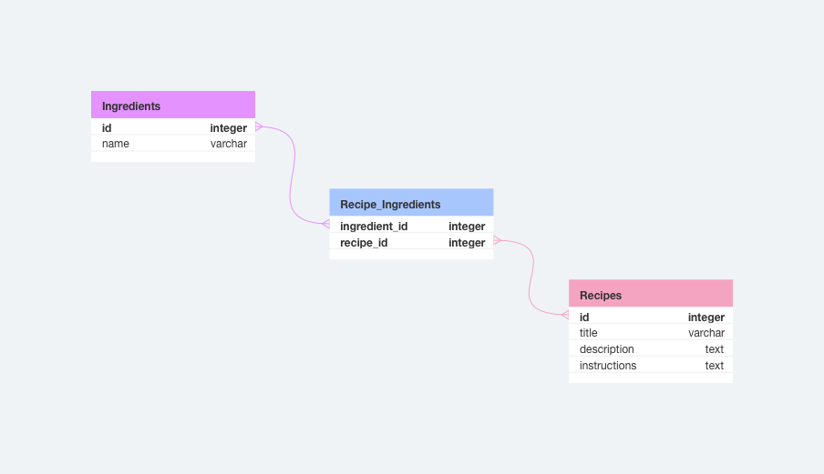

# My Fridge App

In this repository, I will use build a full stack To Do app using React, Node/Express, and MySQL.

## Objectives

- 1 Build a database. my_fridge
    -recipies
    -ingredients
    -recipes_ingredients 
- 2 Build an API server.
- 3 Create a front end.

## Setup

### Dependencies

Run `npm install` in the project folder to install dependencies related to Express (the server).

`cd client` and run `npm install` install dependencies related to React (the client).

### Database Prep

Create `.env` file in project directory and add

```
DB_NAME=todos
DB_PASS=YOUR_PASSWORD
```

(replace `YOUR_PASSWORD` with your actual password)

Alternatively, you can rename the provided `.env.example` file to `.env`.

Type `mysql -u root -p` to access the MySQL CLI using your password.

In the MySQL CLI, type `create database my_fridge;` to create a database in MySQL.

Run the following in the MySQL CLI: `ALTER USER 'root'@'localhost' IDENTIFIED WITH mysql_native_password BY 'YOUR_PASSWORD';` (replace `YOUR_PASSWORD` with your actual password)

Run `npm run migrate` in your **TERMINAL**, in the **project** folder (not your MySQL CLI! Open a new terminal window for this). This will create 3 tables called 'recipies','ingredients' and 'recipes_ingredients' in your database.

### Run Your Development Servers

- Run `npm start` in project directory to start the Express server on port 4000
- `cd client` and run `npm run dev` to start client server in development mode with hot reloading in port 5173.
- Client is configured so all API calls will be proxied to port 4000 for a smoother development experience. Yay!
- You can test your client app in `http://localhost:5173`
- You can test your API in `http://localhost:4000/api`

## Basic Requirements 

## Database Schema


## API routes plan


### 1. Read through all the current code and explain it to your partner.

- [ ] Explain what each line of code is doing.
  - Look at the docs and ask your instructor if you aren't sure!

### 2. Finish the routes

Suggested Process:

- Try and write the correct query in `mysql`.
- Use that query to finish the endpoint in `routes/api.js`.
- Test your endpoint using Postman.


### 3. Finish the front end

- [ ] Add styling.


## Notes

_This is a student project that was created at [CodeOp](http://CodeOp.tech), a full stack development bootcamp in Barcelona._
